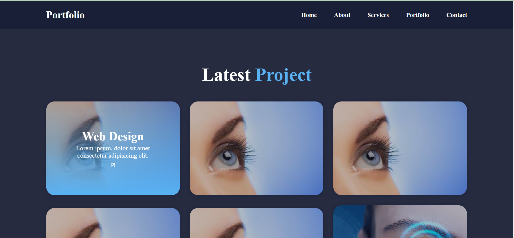
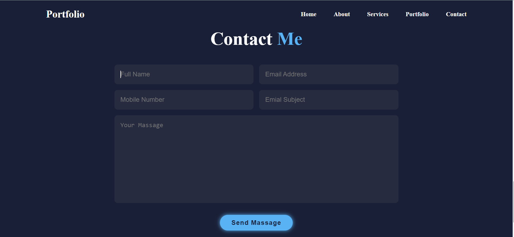

# Responsive Portfolio Website


Welcome to my responsive portfolio website project! This project showcases my skills and projects in a modern, responsive design.

## Table of Contents
- [Demo](#demo)
- [Features](#features)
- [Technologies Used](#technologies-used)
- [Setup](#setup)
- [Usage](#usage)
- [Contributing](#contributing)
- [Contact](#contact)
- 


## Demo
You can view a live demo of the website [here](https://github.com/rjghongade/responsive-portfolio-website).

## Features
- Responsive design that works on all devices
- Smooth scrolling navigation
- Sections for home, about, projects, and contact
- Clean and modern UI


## Technologies Used
- HTML5
- CSS3
- JavaScript

## Setup
To run this project locally, follow these steps:

1. Clone the repository:
    ```sh
    git clone 
    ```

2. Navigate to the project directory:
    ```sh
    responsive-portfolio-website
    ```

3. Open `index.html` in your preferred web browser.

## Usage
- **Home Section**: A welcoming landing page with a background image and a heading.
- **About Section**: A brief description about yourself.
- **Projects Section**: Showcase of your projects with descriptions.
- **Contact Section**: Your contact information.



## Contributing
Contributions are welcome! Please fork the repository and create a pull request with your changes. For major changes, please open an issue first to discuss what you would like to change.



## Contact
If you have any questions or suggestions, feel free to contact me at [rajughongade9022@gmail.com](mailto:rajughongade9022@gmail.com).

---

Thank you for visiting my portfolio website repository!


[screen-capture (1).webm](https://github.com/rjghongade/responsive-portfolio-website/assets/105046011/91d00bc5-5c32-4162-9ba6-ccf063ed6bdb)


